# MapmyIndia_internship
WEEK 1
-----

Differences between CBIR and CBR
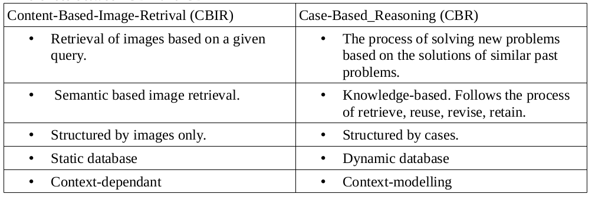
______________________
_Introduction_
_________________________________
Feature extraction for CBIR was originally started using singular features like colour, texture or
shape.
A method for colour based extraction is RGB histogram analysis.
A method for texture based extraction is Gabor filter.
Methods for shape based extraction are edge histogram analysis or HOG (histogram of
gradient).
Since 2012 however, Deep Learning has slowly started overtaking classical methods and are now more popular now using the VGG net or Residual net model.
One of the main reasons often credited for this shift is deep learning’s ability to automatically
extract meaningful representations when trained on a large enough dataset. There are three
methods of searching:
* Image ↔ Image (Searching similar images to retrieve an image)
* Text ↔ Text (Searching simalar words to find similar text)
* Image ↔ Text (Searching for fitting images using text)
___________
_The Process_
_____________________________
Embeddings or vector representations are required for images and text. With the vector models
available, searching is basically finding the closest vector to our input vector and the distance
between vectors is calculated by finding the cosine distance between embeddings.
Given two vectors of attributes, A and B, the cosine similarity, cos(θ), is represented using a dot ), is represented using a dot product and magnitude as 
______________________________________
 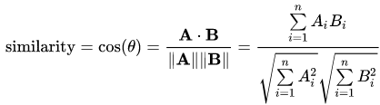
 _____________________________
Similar images will have similar embeddings, meaning a low cosine distance between
embeddings. After the datasets are downloaded for images (1000 images divided into 20 categories), we use VGG16 model (which was trained on ImageNet) to generate embeddings for the images.For text, GloVe model (it was trained on Wikipedia) is downloaded.
The VGGNet used doesn’t include the last Softmax layer (activation function that turns numbers aka logits into probabilities that sum to one. Softmax function outputs a vector that represents the probability distributions of a list of potential outcomes).
The model is used to generate activation values and store them to disk and re-use them, reducing time and computation costs.
____________
_Other topics_
_________________________________
OpenDRIVE is an open file format for the logical description of road networks. It was developed
and is being maintained by a team of simulation professionals with large support from the
simulation industry.
Baidu Maps is a desktop and mobile web mapping service application and technology provided by

Baidu, offering satellite imagery, street maps, street view and indoor view perspectives, as well as
functions such as a route planner for traveling by foot, car, or with public transportation. Android and iOS applications are available.

Georeferencing is the process of assigning real-world coordinates to each pixel of the raster. Many
times these coordinates are obtained by doing field surveys - collecting coordinates with a GPS
device for few easily identifiable features in the image or map.
__________________________________________
_Some bash commands_
_______________________________________
General
__________________
* which python
* ls -ltr or lt (to show file metadata in the list)
* ls -a (shows hidden files)
* grep
* htop
* cd
* mkdir
* chmod +x (to make file executable)
* pwd
* install -r (to install all items in a file)
* pip list
* source filename
* $PATH
* alias
* sudo

Related to virtualenwrapper
___________________
* pip install virtualenv
* workon
* deactivate
* mkvirtualenv
* cdvirtualenv
* rmvirtualenv
/bin are the binary executable files.

Why a virtual environment is preferred? It helps to isolate each project and it also allows the user to
download required packages with the right versions separately and independantly.
In Unix-like computer operating systems, init (short for initialization) is the first process started during booting of the computer system. Init is a daemon process that continues running until the system is shut down.

CUDA is a parallel computing platform and programming model invented by NVIDIA. It enables
dramatic increases in computing performance by harnessing the power of the graphics processing unit (GPU).To install driver through the terminal, command to be used is:
sudo apt-get install nvidia-390

GloVe
It is an unsupervised learning algorithm for obtaining vector representations for words. Training is performed on aggregated global word-word co-occurrence statistics from a corpus, and the resulting representations showcase interesting linear substructures of the word vector space.
The Euclidean distance (or cosine similarity) between two word vectors provides an effective method for measuring the linguistic or semantic similarity of the corresponding words. The main intuition underlying the model is the simple observation that ratios of word-word co-occurrence probabilities have the potential for encoding some form of meaning.

DOM
The Document Object Model is a cross-platform and language-independent application
programming interface that treats an XML document as a tree structure wherein each node is an
object representing a part of the document. The DOM represents a document with a logical tree.

#References
* https://neurohive.io/en/popular-networks/vgg16/
* https://nlp.stanford.edu/projects/glove/
* http://cs231n.github.io/

__________________________________________________________________________

Progress Report (Week 2)
----------
_________________
Dataset and pretrained models loaded. For image queries giving image outputs, indexing and searching possible. However, for mapping words to images, indexing isn't successful.
__________________
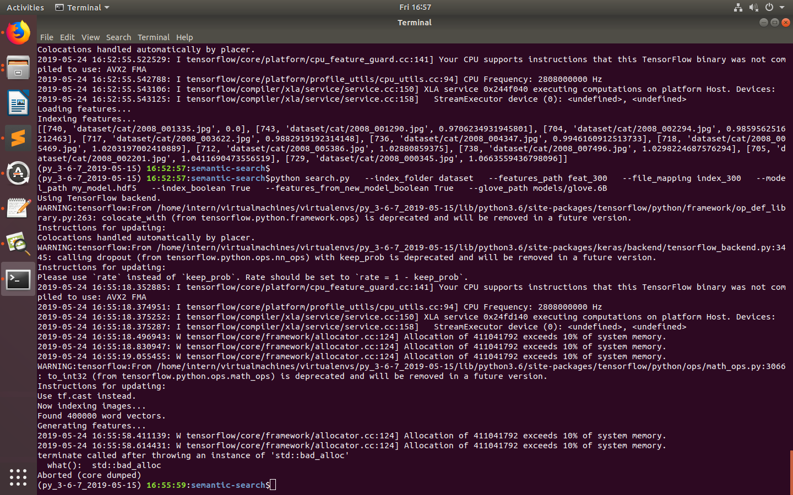
__________

GPU utilization is shallow so following changes made:
__________________
from keras import backend as K
K.clear_session()  
_____________

gpu_options = tf.GPUOptions(per_process_gpu_memory_fraction=0.5)
sess = tf.Session(config=tf.ConfigProto(gpu_options=gpu_options)) [to specify amount of GPU utilization]
________________________

The errors are resolved and demo.py runs for pretrained model

System limitations remain and swap space has to be cleared after a computation heavy task. GPU utilization remains shallow.
_____________________________

Progress Report (Week 3)
----------
_________________

Links for Wednesday's Poetry Corner presentation
____

* https://www.youtube.com/watch?v=-6-h-KGfrGc

* https://www.youtube.com/watch?v=M_Gziz-S4A0

* https://www.youtube.com/watch?v=vXpS9Eo_nx8

* https://www.youtube.com/watch?v=GoXI088KNwU

* https://ink.library.smu.edu.sg/cgi/viewcontent.cgi?referer=&httpsredir=1&article=3320&context=sis_research 

_____________________

Changing the dataset (101_ObjectCategories from Caltech dataset library). So categories changed. 

Potholes was not present in the ImageNet dataset on which VGG16 was pretrained, but the model is capable of searching it after indexing the feautures based on general features

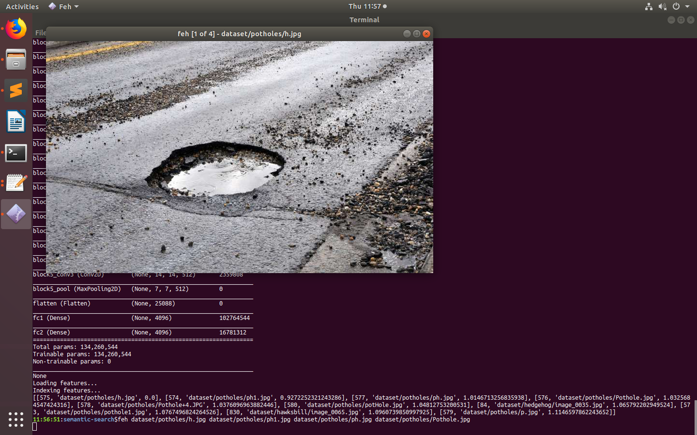

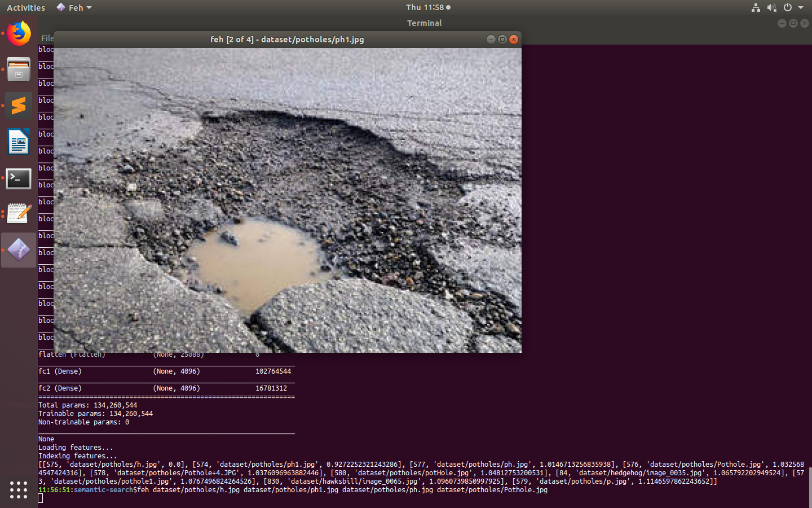

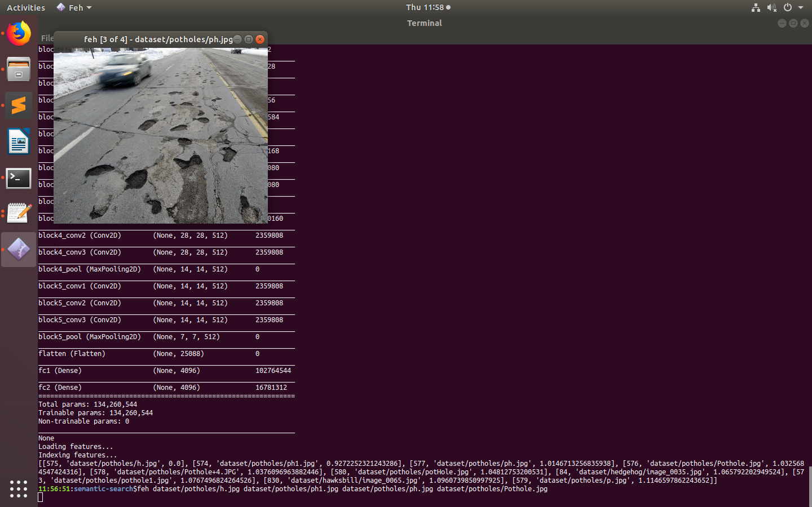

Shell command
* find.-iname "* .py" -type f -exec grep inH --colour "auto" "[Searchword]" {} \:
* sudo swapoff (or swapon) -a

Replacing VGG16 with ResNet50 

#Changes made to search.py

Ref: https://gogul09.github.io/software/flower-recognition-deep-learning and https://github.com/keras-team/keras/blob/master/keras/applications/resnet50.py

However error occurring 
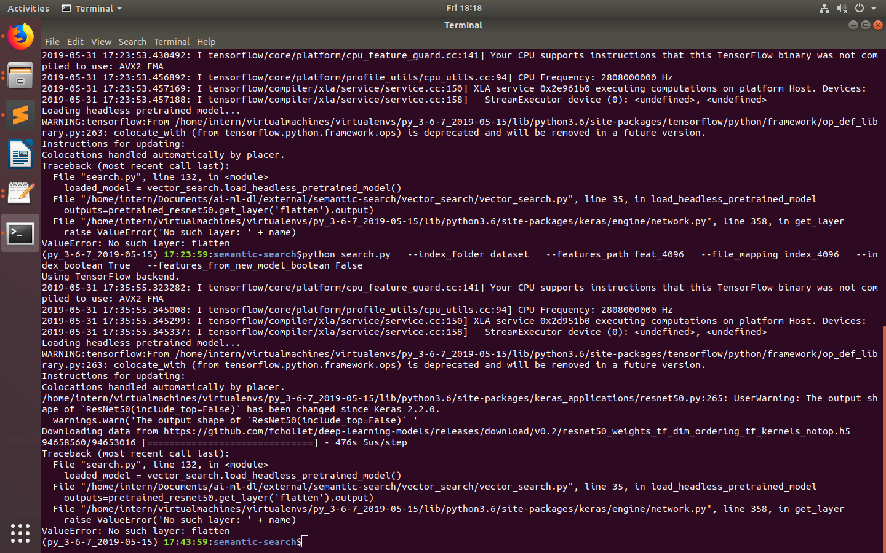
_______________________

Progress report (Week 4)
-------

VGG16 replaced by ResNet50. Pretrained model of Keras applications used. A new set of features and indices saved to disk and loaded when similar images are to be searched. The last two layers of traditional ResNet50 model are not included in our model. 

Searching for similar lotus pictures
* 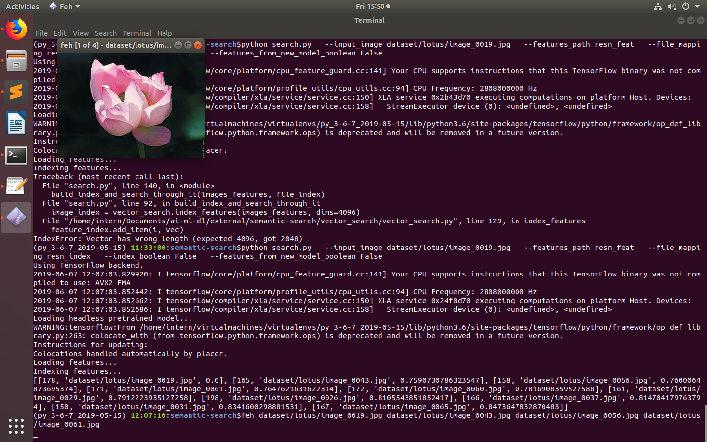
* 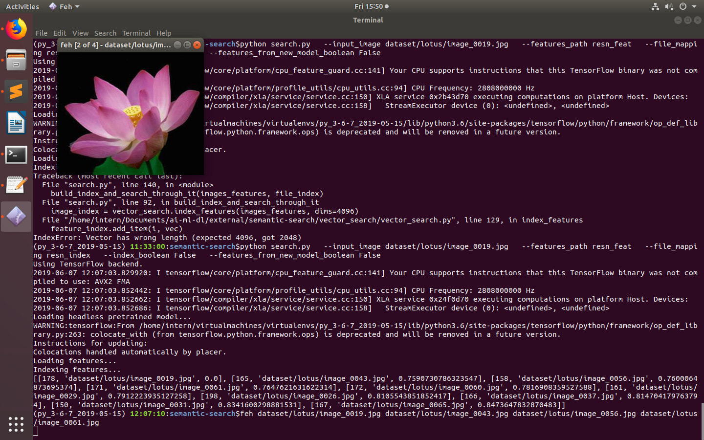
* 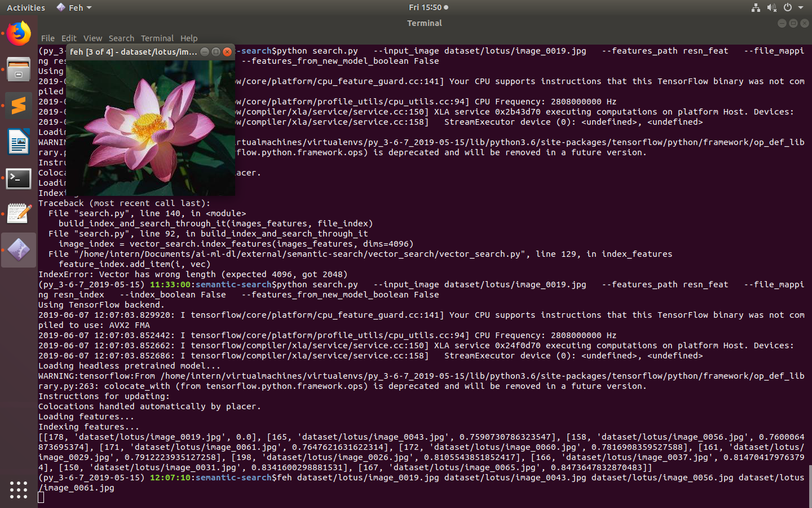
* 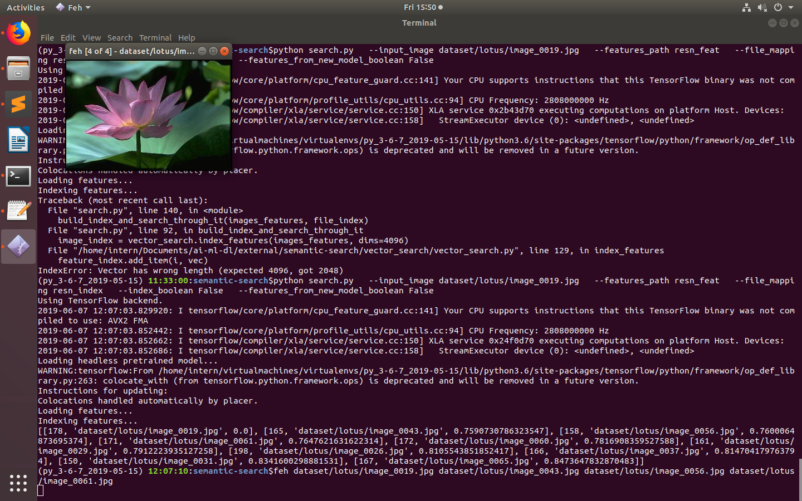

Original ResNet50 model

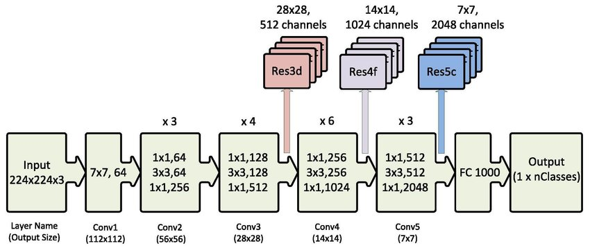

Our model doesn't include FC1000 and the Output layers
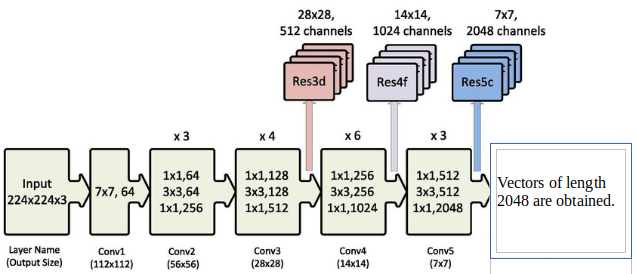
